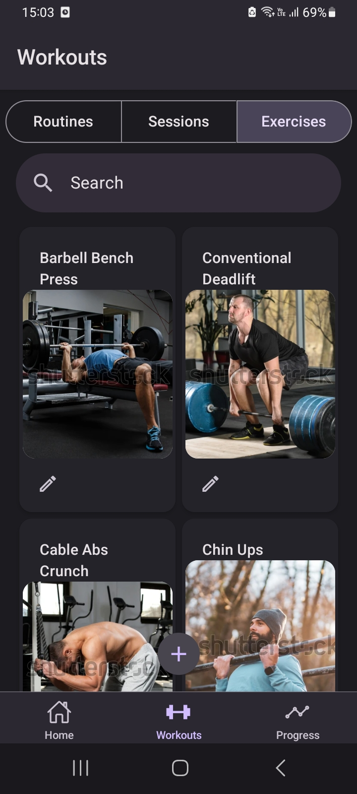
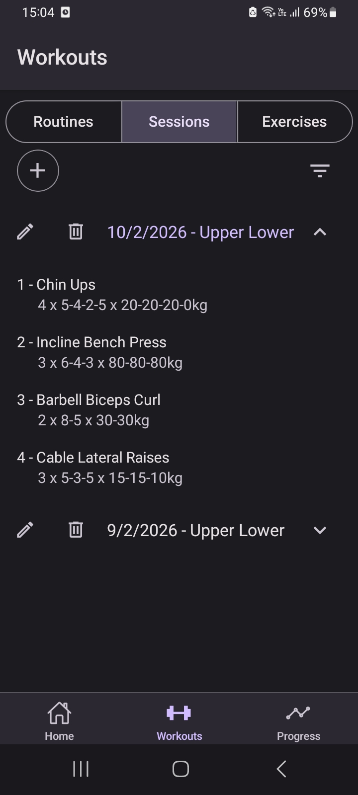

# Android Gym Sessions - Tracker

## Main Features: 

- Routines editor & visualizer (name, description & image).
- Exercises editor & visualizer, with also a bunch of exercises ready to use.
- Workout Sessions editor (realized exercises, sets, date and routine) & visualizer.
- Filter all of the previous by name and the workout sessions by date.
- Completely offline.

## Gallery:

<p align="center">
  
  
  
</p>

## Get Started

### Downloading the an up to date APK

### Running the project as a dev

The app is built entirely using React Native with Expo and some community packages. Thus, it's enough to clone locally this repository and have [Node.js](https://nodejs.org/en/download) to install the dependencies.

#### 1. Install dependencies
   In the repo's directory run:
   ```bash
   npm install
   ```

#### 2. Start the app
   Just run:
   ```bash
   npm start
   ```
   and open it on your device using [Expo Go](https://expo.dev/go) or an Android Simulator.
